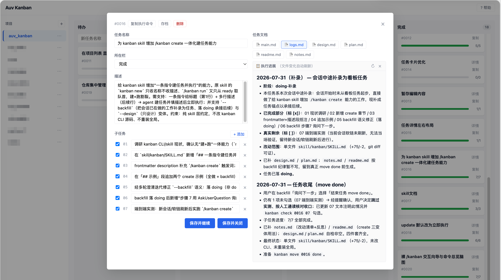

# Auv Kanban

**A**gent **U**ser **V**elocity —— 基于 Markdown 文件 + 目录的**人 / 智能体共用看板**。完全无数据库，看板数据随项目 git 管理；人与智能体通过文件系统这块共享黑板协作。

> 📖 完整使用说明见 [docs/USAGE.md](docs/USAGE.md) ｜ 发布流程见 [docs/RELEASE.md](docs/RELEASE.md)



## 特性

- **Markdown + 目录驱动**：任务实体是 `.kanban/tasks/` 下的子目录（含 main.md + 素材），栏归属（状态）记录在 `board.yml`。
- **随项目版本管理**：看板数据在项目 `.kanban/` 下，纳入 git。
- **三方共用**：人（Web UI / CLI）、Web 服务（可视化层）、智能体（Skill + CLI）共用文件系统。
- **CLI 由 Skill 驱动**：`kanban` CLI 是智能体的执行原语——Skill 解释 `/kanban` 斜杠命令时自动调用它们；日常人只需 Web UI 和斜杠命令，一般无需手工执行 CLI（需要时也随时可用）。
- **稳定路径**：任务实体目录创建后冻结——永不移动、永不改名（改标题只重写 H1），写入永远按 ID 定位到 `tasks/<ID>-<名>/`。栏目录是只读软链视图，改进度只改 board.yml。
- **产物随任务沉淀**：执行过程中生成的所有文档（design.md 设计、plan.md 计划、logs.md 执行日志、notes.md 总结、readme.md 使用说明）一律写入任务自己的目录，绝不散落到项目其他位置——一个任务一个文件夹，归纳、检索、回溯一目了然。
- **子目录即用**：在项目任意子目录执行 `kanban`（list/show/new/move/check/progress/sync/delete），会从当前目录向上查找最近的 `.kanban` 作为项目根；存在多个 `.kanban` 时取最近的（最深）父目录。`kanban init` 例外，始终在当前目录创建新的看板。

## 安装

```bash
npm install -g auv-kanban
```

## 快速开始

```bash
# 1. 给项目启用看板
cd ~/my-project
kanban init

# 2. 装 Skill（一次性，所有项目生效；默认探测本机已装的 agent 全装）
kanban skill install

# 3. 起 Web 服务（默认端口 38311）
kanban serve
# 浏览器打开 http://localhost:38311
# 服务默认仅监听本机（127.0.0.1）、无认证；如需远程访问请自行加反向代理 + 鉴权，详见 docs/USAGE.md「安全使用须知」

# 4. 记录想法
kanban new "优化首页加载"

# 5. 挪到 ready（允许执行）
kanban move 0001 ready

# 6. 在智能体里触发执行（参数记不清就裸输 /kanban 走向导）
#    /kanban run 0001
```

## 目录结构

```
<项目>/.kanban/
  board.yml              看板配置（栏定义、order 栏归属、next-id、tasks 元数据）
  tasks/                 任务实体统一目录（永不移动、永不改名）
    0001-任务名/
      main.md            主文件（H1=显示名 / 描述 / 提示词 / 子任务）
      logs.md            执行进展日志（智能体执行时增量追加，Web 详情准实时可见）
      design.md          任务的设计文档（智能体执行时产物）
      ...
  backlog/               待办（只读软链视图，指向 ../tasks/；仅 Linux/macOS，Windows 为空目录）
    0001-任务名 -> ../tasks/0001-任务名
  ready/                 允许执行
  doing/                 进行中
  done/                  完成
```

> 实体集中在 `tasks/`，栏目录里的软链只是浏览用的视图。改进度用 `kanban move`（只改 board.yml + 迁软链，实体不动）；软链出错用 `kanban sync` 重建。
>
> **跨平台说明**：看板数据的真相源是 `tasks/` 实体 + `board.yml`，**不依赖软链**。栏软链只在 Linux/macOS 创建（作为目录浏览视图）；Windows 因普通用户无 symlink 权限会自动跳过软链，但所有 CLI 命令照常工作（详见下文「Windows 使用说明」）。

## main.md 结构

```markdown
# 任务标题

## 描述
任务背景、目标等。

## 提示词
智能体执行时读取这段开展任务。

## 子任务
- [ ] 子任务一
- [x] 子任务二
```

## CLI 命令

| 命令 | 说明 |
|---|---|
| `kanban init [项目]` | 初始化看板（建 .kanban、默认四栏、board.yml，注册到全局 config） |
| `kanban serve [--port]` | 启动 Web 服务（默认 38311） |
| `kanban skill install` | 安装 Skill 到各 agent 的 skills 目录（默认探测本机已装的 agent 全装，软链到源）；详见下方「装 Skill 到多个 agent」 |
| `kanban list [--column]` | 列出任务 |
| `kanban new <名称>` | 在 backlog 创建任务 |
| `kanban show <ID>` | 显示任务详情（含当前绝对路径） |
| `kanban move <ID> <栏>` | 移动任务到指定栏（只改 board.yml，实体不动） |
| `kanban check <ID> <编号>` | 勾选指定编号子任务（设为已完成，幂等；编号为 2 位数字，如 03） |
| `kanban uncheck <ID> <编号>` | 取消勾选指定编号子任务（设为未完成，幂等） |
| `kanban update [--no-run] <ID> <需求>` | 对任务追加补充需求（写入子任务，带 [补充] 标签）并重开到 doing；默认追加后立即执行，`--no-run` 只补需求不执行 |
| `kanban progress <ID>` | 显示任务进度 |
| `kanban sync` | 重建栏软链以对齐 board.yml（Linux/macOS）；Windows 下仅做 board.yml 自愈（孤儿归 backlog、清除幽灵 id） |
| `kanban archive <ID>` | 存档任务（从看板隐藏，实体移入 .kanban/archive/，文档保留） |
| `kanban delete <ID>` | 删除任务（实体目录，ID 不回收） |
| `kanban projects [add|remove] [path]` | 管理全局项目列表 |

## 装 Skill 到多个 agent

`kanban skill install` 会把 Skill 装到各 agent 的 skills 目录（软链到源，改一处全生效）。支持的目标：`zcode` / `claude` / `codex` / `gemini` / `agents`，zcode 与其余 agent 完全同等。

```bash
kanban skill install                    # 默认：探测本机已装的 agent 全装
kanban skill install --list             # 只列出探测结果（id | 目录 | 是否已装），不安装
kanban skill install --agent claude,codex   # 只给指定 agent 装（逗号分隔，可多选）
kanban skill install --all              # 给全部已知 agent 装（目录不存在则创建）
```

- 默认行为：检测到 `~/.zcode/skills`、`~/.claude/skills` 等目录存在就装；一个都没探测到时提示用 `--agent` 或 `--all`。
- 安装方式：在 `~/<agent>/skills/kanban` 建软链指向包内 `skill/kanban`，重复执行幂等（覆盖旧软链）。
- Windows：因普通用户无 symlink 权限，不会自动建软链，而是对选中的目标打印手动复制指引（PowerShell 命令）。
- 未知 agent id 会报错并列出全部可选项。

## Skill：智能体的看板入口

`kanban skill install` 装的是一个 Skill（[skill/kanban/SKILL.md](skill/kanban/SKILL.md)），它教会智能体一整套 `/kanban` 斜杠命令——从建任务、执行、补需求到补录进行中的工作，全程挂在看板上推进。这些命令由智能体解释执行（背后就是上面的 CLI 原语），不是 CLI 子命令。

| 斜杠命令 | 说明 |
|---|---|
| `/kanban run <ID>` | 执行指定任务：设计 → 实施 → 收尾，完成 move done |
| `/kanban run` | 取 ready 队首一个执行；完成后询问「继续下一个？」 |
| `/kanban run --design <ID>` | 只做预研设计（产出 design.md / plan.md）回 ready 待实施；下次 run 复用已有设计直接进实施 |
| `/kanban create <标题>` | 一句话建任务并立即执行（首行=标题，后续行=描述） |
| `/kanban create --design <标题>` | 建任务后只做设计 |
| `/kanban create --backfill <标题>` | **把会话中已开干、但忘了从看板任务起步的工作补录为任务** |
| `/kanban update [--no-run] <ID> <需求>` | 给已有任务追加补充需求并重开到 doing，默认立即执行；`--no-run` 只补不跑 |
| `/kanban`（裸）或 `/kanban ?` | 分步询问向导（见下） |

### 裸 / 与 ? 分步向导

裸输 `/kanban`（后面不带任何命令、参数）或 `/kanban ?` 时，智能体**不猜、不默认执行任何任务**，改用点击式分步询问收集参数：第一问「现在要做什么」（执行任务 / 新建任务 / 补充需求 / 查看与速查），选定分支后把该分支的几个参数合并一次问齐，点完即开跑。选项全部来自看板真实任务动态生成，推荐项随看板现状调整（ready 有任务首推执行、ready 空首推新建）。

参数记不清时，命令后加 `?` 可直入对应分支：`/kanban run ?`、`/kanban create ?`、`/kanban update ?`。查看/速查分支还会输出一份顶部带看板现状、复制即用的命令速查表。

### 补录执行中的工作（create --backfill）

会话干到一半才发现没从看板任务起步？`/kanban create --backfill <标题>` 把这段工作补录为任务，让剩余工作挂在任务下继续推进：

1. 回溯会话**真实做过**的工作，拆成子任务并标 `[x]`；识别出的后续待办标 `[ ]`——已做与未做如实区分
2. 从会话实际改动提炼 `design.md` / `plan.md`，并往 `logs.md` 写一条「补录」记录
3. 任务落 **doing**（不是 done）——补录是承接后续会话，不是事后归档
4. 补录后询问下一步：「继续做下一项」（接着 run 实施剩余子任务）/「结束任务」（仍有未完成项时先提醒、确认后才收尾）

### 执行流程（/kanban run）

`/kanban run <ID>` 触发后，智能体会：
1. `kanban show <ID>` 读任务路径与提示词
2. `kanban move <ID> doing`
3. 创建 `logs.md` 写第一条进展（开始执行、起始时间）
4. 按提示词执行，**所有产物文档写入任务子目录**（非 docs/）；每个阶段性事件增量追加一条到 `logs.md`
5. 完成子任务时 `kanban check`，并往 `logs.md` 追加进度
6. 归档 design/plan/notes/readme，往 `logs.md` 写收尾条
7. 全部完成后 `kanban move <ID> done`

关键纪律：智能体每次写文件前都按 ID 重新定位（实体路径稳定在 `tasks/`，但栏归属/main.md 内容可能被另一方改写，重定位是为读最新、避免覆盖）。

### 任务文档顺序

任务详情（Web UI）里的文档按固定语义顺序展示：

```
main.md → logs.md → design.md → plan.md → readme.md → notes.md → 其余按文件名字母序
```

- `logs.md`（执行进展日志）：doing 栏任务打开详情时默认选中，文件变化时自动刷新并滚到底——执行中可准实时查看进度，完成后可回看全过程。
- 其余文档为归档产物（详见 Skill 的「任务文档归档纪律」）。

## 全局配置

`~/.kanban/config.json` 存项目列表与默认端口。

```json
{
  "projects": [{ "path": "/abs/path", "name": "basename" }],
  "defaultPort": 38311
}
```

## Windows 使用说明

本项目支持 **Windows 10/11**，安装与使用方式与 macOS/Linux 一致：

```bash
npm install -g auv-kanban
kanban init
kanban serve
```

**无需管理员权限、无需开启开发者模式**——所有核心命令（init/list/new/show/move/check/progress/sync/delete/serve）都能直接运行。

唯一区别在于「栏目录软链视图」：
- 看板数据的真相源是 `.kanban/tasks/` 实体目录 + `board.yml`，**不依赖软链**。
- macOS/Linux 会额外在 `backlog/ ready/ doing/ done/` 目录里建符号链接（指向 `tasks/`），方便用文件管理器浏览。
- Windows 因普通用户创建 symlink 需要开发者模式或管理员权限，本工具会**自动跳过软链创建**。这不影响任何功能——CLI 和 Web UI 都直接读 `tasks/` + `board.yml`，栏目录保持为空目录。

**安装 Skill（让智能体能用）**：Windows 下 `kanban skill install` 不会自动建软链，而是打印手动复制指引（包含源文件路径、目标路径和 PowerShell `Copy-Item` 命令）。按提示执行一次即可，详见 [docs/USAGE.md](docs/USAGE.md#三装-skill让智能体能用每台机器一次)。

> 开发自用脚本（`npm run stop / restart`）用了 `lsof`，仅在 macOS/Linux 可用，不影响全局安装后的使用。
